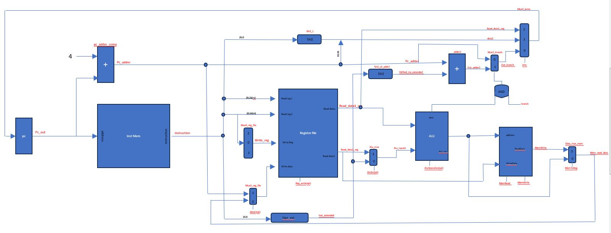
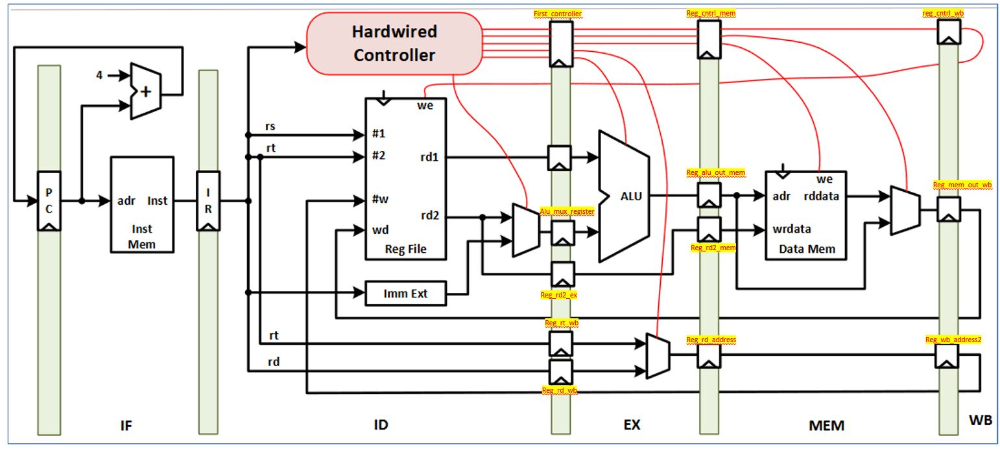
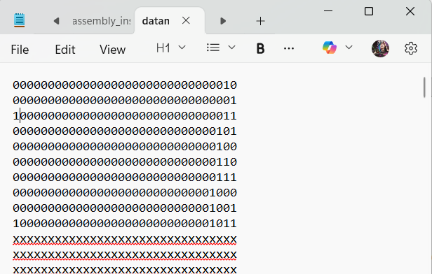
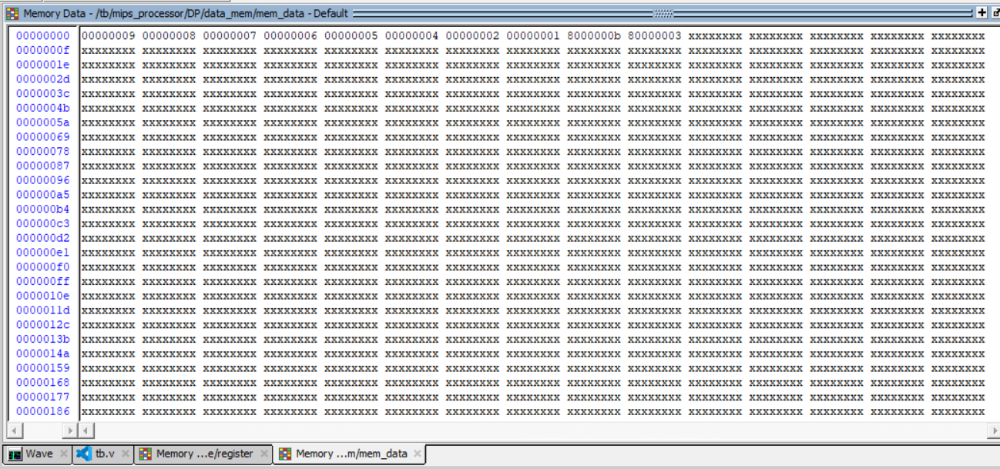
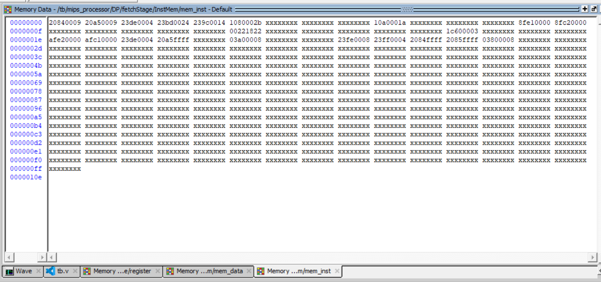
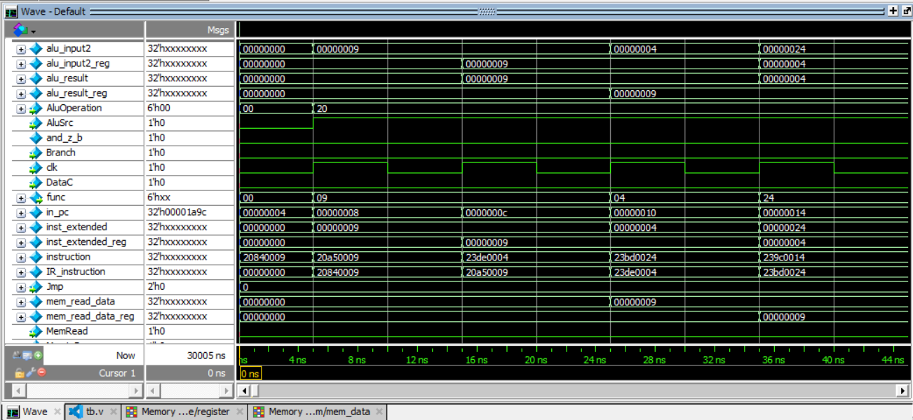
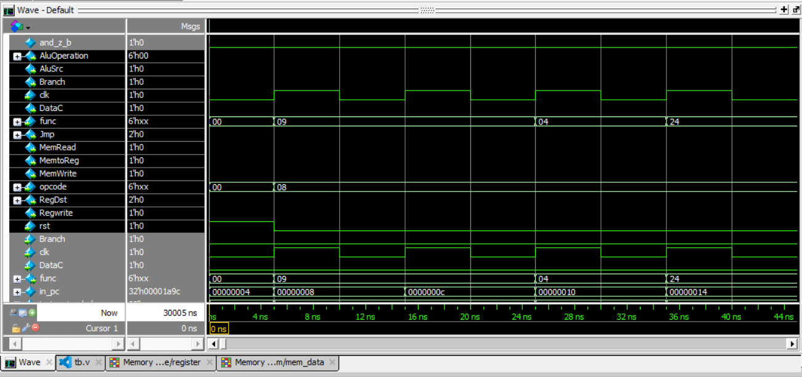

#  5-Stage Pipelined MIPS Processor (No Forwarding) | Verilog

A fully functional **5-stage pipelined MIPS processor** implemented in **Verilog HDL**, designed and verified as part of the **Advanced Computer Architecture course at the University of Tehran**.

This processor executes real assembly programs and was validated using a **Bubble Sort algorithm** that sorts 10 numbers stored in Data Memory.


---

##  Overview

This project implements a classic **MIPS pipeline architecture** consisting of the following stages:

1. Instruction Fetch (IF)
2. Instruction Decode (ID)
3. Execute (EX)
4. Memory Access (MEM)
5. Write Back (WB)

Unlike more complex CPUs, this design **does NOT include a forwarding unit**.  
All data hazards are resolved manually using **NOP instructions**.

This allows clearer visualization and understanding of pipeline timing and hazard behavior.


---

## 🎯 Key Features

✅ 5-stage pipeline architecture  
✅ Modular Verilog implementation  
✅ Separate Instruction Memory and Data Memory  
✅ Fully functional Control Unit and Datapath  
✅ Pipeline registers between all stages  
✅ ModelSim simulation verified  
✅ Bubble Sort assembly program execution  
✅ Real waveform verification  

---

## 🏗️ Processor Architecture

### Datapath Structure

Below is the complete datapath of the pipelined processor:

<p align="center">

</p>

Pipeline registers are inserted between each stage to enable parallel instruction execution.

---

### Pipeline Stages Diagram

<p align="center">

</p>

Each instruction passes through all five stages regardless of instruction type.

---

##  Project Structure
```text
├── fetch.v
├── decode.v
├── execute.v
├── datapath.v
├── alu.v
├── register.v
├── inst_memory.v
├── data_memory.v
├── controller.v
├── opcode_constants.v
├── top.v
└── testbench.v
```

## 🧩 Major Modules

### Fetch Stage

Responsible for:

• Reading instruction from Instruction Memory  
• Updating Program Counter  

---

### Decode Stage

Responsible for:

• Instruction decoding  
• Register file access  
• Immediate extension  
• Control signal generation  

---

### Execute Stage

Responsible for:

• ALU operations  
• Arithmetic and logical instructions  

---

### Memory Stage

Responsible for:

• Data Memory read/write  

---

### Writeback Stage

Responsible for:

• Writing results back into Register File  

---

## 🚫 No Forwarding Unit

This processor does not implement forwarding.

Instead, hazards are resolved using:


nop
nop
nop


This ensures correct execution while keeping the architecture simpler.

---

## 🧪 Test Program: Bubble Sort

The processor executes a Bubble Sort program that:

• Reads 10 numbers from Data Memory  
• Compares adjacent numbers  
• Swaps them if needed  
• Produces a sorted array (descending order)

---

## 💾 Data Memory Before Sorting

<p align="center">

</p>

---

## 💾 Data Memory After Sorting

<p align="center">

</p>

Sorted correctly from largest → smallest.

---

## 📜 Instruction Memory

Contains Bubble Sort assembly instructions:

<p align="center">

</p>

Includes:

• load word  
• store word  
• branch instructions  
• arithmetic instructions  
• nop instructions  

---

## 📈 Simulation Waveforms (ModelSim)

Waveforms confirm correct pipeline operation:

<p align="center">

</p>

Shows:

• pipeline stage activity  
• register updates  
• memory access  
• control signals  

---

<p align="center">

</p>

Correct execution of Bubble Sort verified.

---

## 🛠️ Tools Used

• Verilog HDL  
• ModelSim  
• MIPS Assembly  
• Digital Logic Design  

---

## 🎓 Academic Context

Course:

**Advanced Computer Architecture**

Institution:

**University of Tehran**

---

## 👨‍💻 Author

**Behzad Jannati**

MSc Computer Architecture  
University of Tehran  

GitHub:  
https://github.com/bhzadjnty7

LinkedIn:  
www.linkedin.com/in/behzadjannati

---

## 📜 License

MIT License

---

## ⭐ Why this project matters

This project demonstrates:

• CPU microarchitecture design  
• Pipeline implementation  
• Hazard understanding  
• Hardware simulation and verification  
• Verilog hardware development  

It is a complete educational CPU implementation.

---

## Repo Structure
```text
repo/
│
├── src/
│   ├── fetch.v
│   ├── decode.v
│   ├── execute.v
│   ├── datapath.v
│   └── ...
│
├── simulation/
│   ├── testbench.v
│   └── modelsim_files
│
├── images/
│   ├── datapath.png
│   ├── pipeline_structure.png
│   ├── waveform1.png
│   ├── waveform2.png
│   ├── data_memory_before.png
│   ├── data_memory_after.png
│   └── instruction_memory.png
│
├── report/
│   └── report.pdf
│
└── README.md
```
